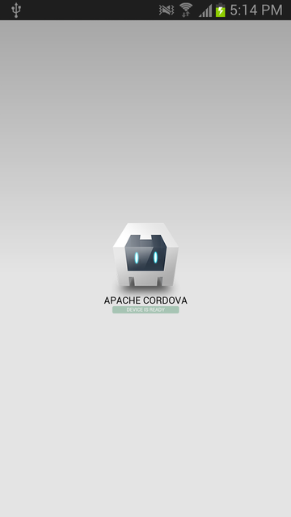
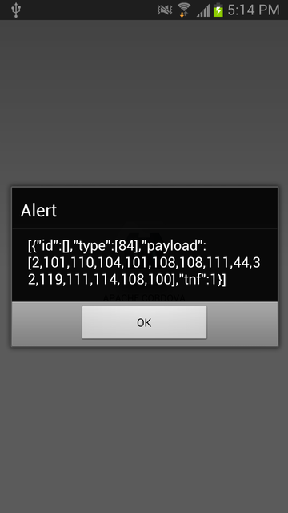
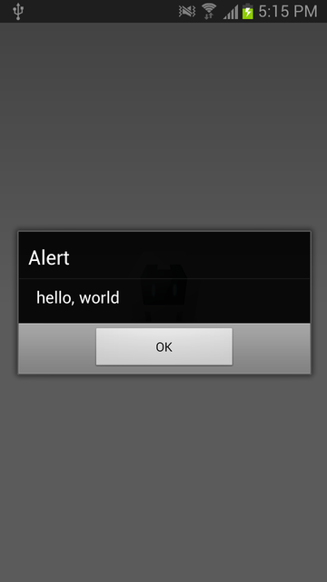

**These are legacy instructions for PhoneGap 2.9.**

**Cordova 3.0 is the recommended way to use phonegap-nfc, see [Getting Started Cordova CLI](https://github.com/chariotsolutions/phonegap-nfc/blob/master/doc/GettingStartedCLI.md).**

## Quickstart for PhoneGap NFC on Android

Follow these instructions to generate a default PhoneGap app and modify it to read NFC tags.

### PhoneGap 2.9
    
PhoneGap NFC requires PhoneGap 2.9.x.  Download from [phonegap.com](http://phonegap.com/download). Unzip the archive in `/usr/local`.

### Plugman 0.10.0

Plugman is used to install the plugin into the PhoneGap project. Plugman requires [node.js](http://nodejs.org). Plugman 0.10.0 or greater is recommended. Install plugman globally.

    $ npm install plugman -g
        
### Generate a project

    $ cd ~
    $ /usr/local/phonegap-2.9.0/lib/android/bin/create foo com.example.foo Foo

### Install the Plugin

    $ plugman --platform android --project foo --plugin git://github.com/don/phonegap-nfc.git
            
### Edit `index.js`

Edit `index.js` and modify onDeviceReady with the following code

    onDeviceReady: function() {
        app.receivedEvent('deviceready');
        
        // Read NDEF formatted NFC Tags
        nfc.addNdefListener (
            function (nfcEvent) {
                var tag = nfcEvent.tag,
                    ndefMessage = tag.ndefMessage;
            
                // dump the raw json of the message
                // note: real code will need to decode
                // the payload from each record
                alert(JSON.stringify(ndefMessage));

                // assuming the first record in the message has 
                // a payload that can be converted to a string.
                alert(nfc.bytesToString(ndefMessage[0].payload).substring(3));
            }, 
            function () { // success callback
                alert("Waiting for NDEF tag");
            },
            function (error) { // error callback
                alert("Error adding NDEF listener " + JSON.stringify(error));
            }
        );
    },
        
### Run the code

Plug your phone into your computer.
    
Build and run the code

    $ cd ~/foo
    $ ./cordova/run
    
### Scan a NDEF tag

Scan an NDEF tag with your phone. If you need to put data on a tag, try writing a plain text message to a tag with [NXP Tag Writer](https://play.google.com/store/apps/details?id=com.nxp.nfc.tagwriter).
    

     
    
    
