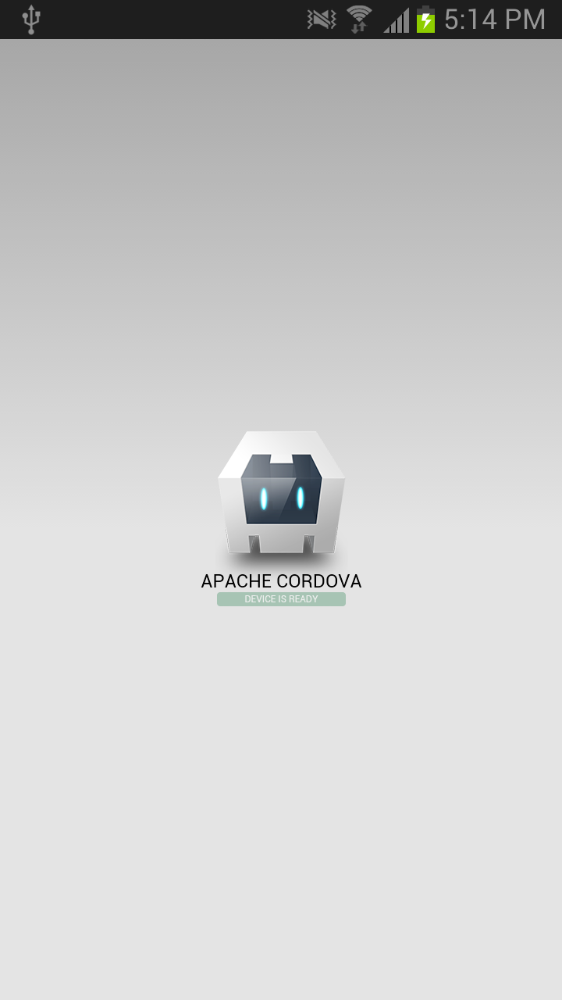
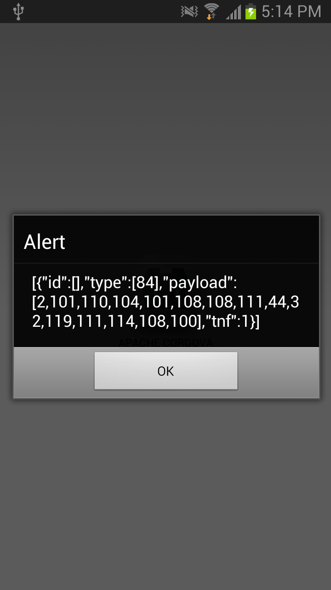
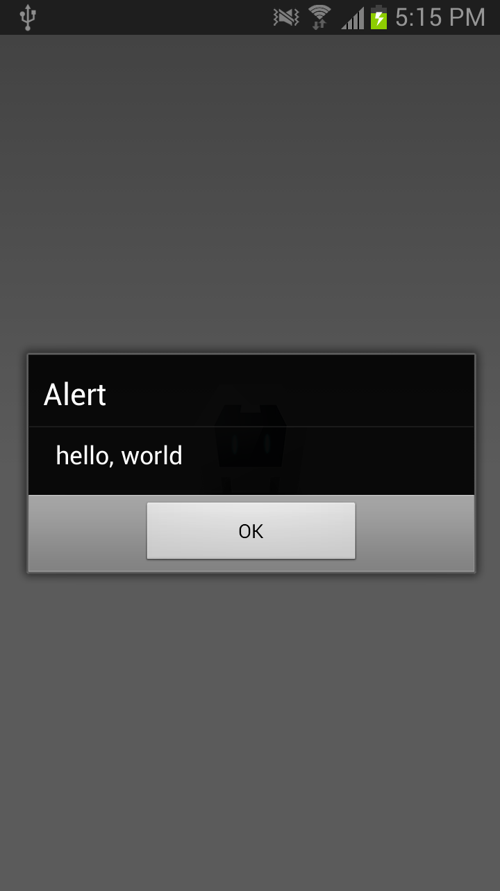

## Quickstart for PhoneGap NFC - Cordova CLI

These instructions use [Cordova](http://codova.io) to generate a default PhoneGap app and modify it to read NFC tags.

### Cordova Command Line Interface (CLI)

The Cordova Command Line Interface [cordova-cli](https://npmjs.org/package/cordova) can be used to create, build and run multi-platform Cordova projects. Cordova CLI requires [node.js](http://nodejs.org), [git](http://git-scm.com/) and the SDK tools for your target platform (Android, BlackBerry10 or Windows Phone 8.)

    $ npm install cordova -g
    
If you are still using PhoneGap 2.9 see the legacy [Getting Started](GettingStarted.md).
        
### Generate a project

    $ cd ~
    $ cordova create foo com.example.foo Foo

### Add Android

    $ cd foo
    $ cordova platform add android

### Install the Plugin

    $ cordova plugin add https://github.com/chariotsolutions/phonegap-nfc.git
            
### Edit `index.js`

Edit `index.js` and modify onDeviceReady with the following code

    onDeviceReady: function() {
        app.receivedEvent('deviceready');
        
        // Read NDEF formatted NFC Tags
        nfc.addNdefListener (
            function (nfcEvent) {
                var tag = nfcEvent.tag,
                    ndefMessage = tag.ndefMessage;
            
                // dump the raw json of the message
                // note: real code will need to decode
                // the payload from each record
                alert(JSON.stringify(ndefMessage));

                // assuming the first record in the message has 
                // a payload that can be converted to a string.
                alert(nfc.bytesToString(ndefMessage[0].payload).substring(3));
            }, 
            function () { // success callback
                alert("Waiting for NDEF tag");
            },
            function (error) { // error callback
                alert("Error adding NDEF listener " + JSON.stringify(error));
            }
        );
    },
        
### Run the code

Plug your phone into your computer.
    
Build and run the code

    $ cd ~/foo
    $ cordova run
    
### Scan a NDEF tag

Scan an NDEF tag with your phone. If you need to put data on a tag, try writing a plain text message to a tag with [NXP Tag Writer](https://play.google.com/store/apps/details?id=com.nxp.nfc.tagwriter).
    

     
